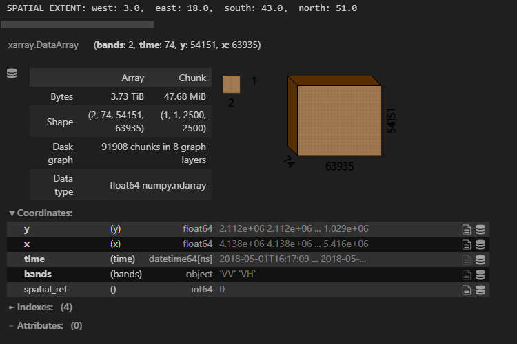

# Aggregate data over large spatial extents

Date: 2024-02-26

## Context

https://github.com/Open-EO/openeo-processes-dask/issues/124

In a recent use case, the `aggregate_spatial` process was applied to both Sentinel 1 and Sentinel 2 data to generate `vector-cubes` with polygons from [here](https://github.com/openEOPlatform/SRR3_notebooks/blob/main/notebooks/resources/UC8/vector_data/target_canopy_cover_60m_WGS84/target_canopy_cover_WGS84_60m.geojson). As `process graphs` are executed node after node, we would first use `load_collection` to load the data over the total bounds of the polygons and hand the data to `aggregate_spatial` afterwards. 
With the total bounds of all polygons being set to `{'west': 3, 'east': 18, 'south': 43, 'north': 51}`, loading the data led to the following situations: 

- We were able to load the data, for short temporal extents: 
<figure>
    
    <figcaption>Figure 1: Lazy dask array for Sentinel 1 datacube. Note the size of data: 3.73 TiB</figcaption>
</figure>

- When increasing the temporal interval, the amount of data became too much for dask and the corresponding error was raised. 
<figure>
    
</figure>

It is not trivial to solve this in dask, as 
- this means that one chunk cannot handle the amount of data, that is supposed to be in the chunk.
- setting a smaller chunk size, means more and more chunks are generated and the dask task graph can easily become too large itself.
- increasing the dask memory might solve the problem for one specific dataset, but it might occur again, if a different dataset with a higher spatial or temporal resolution is used afterwards. 

This means, that running through the `process graph` raises an error, before `aggregate_spatial` can be executed. 

## Possible solutions

There might be more than one solution to this. 

Here is a first attempt on how we were trying to solve this.  

In `openeo-processes-dask`, there is a general implementation of `aggregate_spatial` available, that can be run, as long as the input data can be read by dask and the error described above does not occur. If the error is raised, the execution of the processes or the process implementations might need adaptions.

### Handle data loading within aggregate_spatial

Here is a pseudo-code for another `aggregate_spatial` implementation: 

<CodeSwitcher>
<template v-slot:py>

```python
def aggregate_spatial(
    data,
    geometries,
    reducer):

    vector_cube = []
    groups = group_geometries(geometries)

    for group in groups:
        small_data = load_collection(group.bounds)
        small_data = apply_processes(small_data)

        for geometry in group: 
            polygon_data = aggregate(small_data, geometry, reducer)
            vector_cube.append(polygon_data)
    
    return vector_cube
``` 

Remarks: 
- you might want to group your geometries based on how close they are to each other
- handling data loading inside of the aggregate_spatial process can be very backend specific, depending on how you define the load_collection process and on how you execute process graphs - you might need to delay the data loading in load_collection, if the process is executed before aggregate_spatial. 
- when you load the data in aggregate spatial, you might also need to apply processes to it that are in the process_graph and should be executed prior to aggregate_spatial. 
- if you group your geometries in the beginning, the order of the resulting vector_cube might be adapted, you might want to sort the data in a final step. 
- the code seems rather basic, as it makes use of a simple for-loop. We were trying to avoid this, but ran into several issues for the other attempts we had. (Trying to handle this in dask, might make the task graph too large. Trying to use sparse arrays can be very tricky, when geometries are distributed all over Europe, and do not have a native order. ) 
